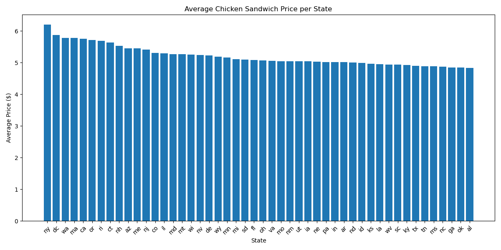
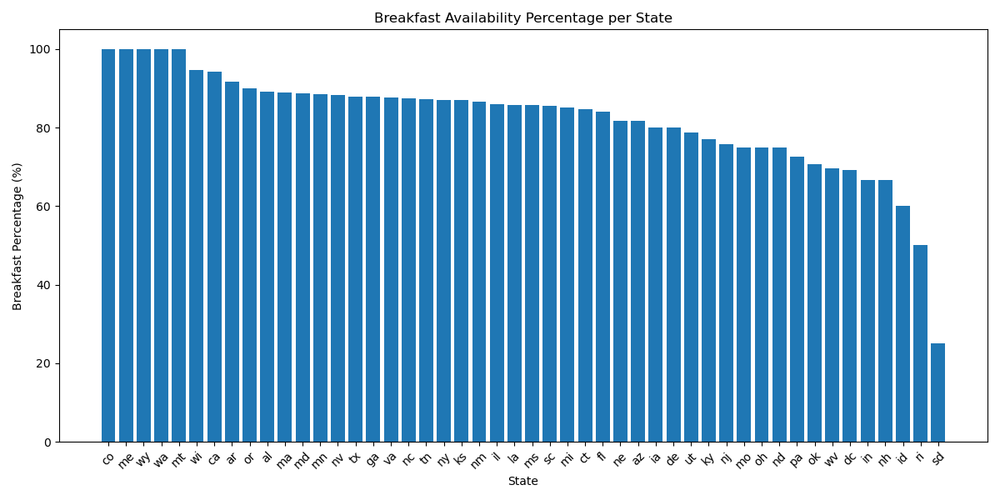
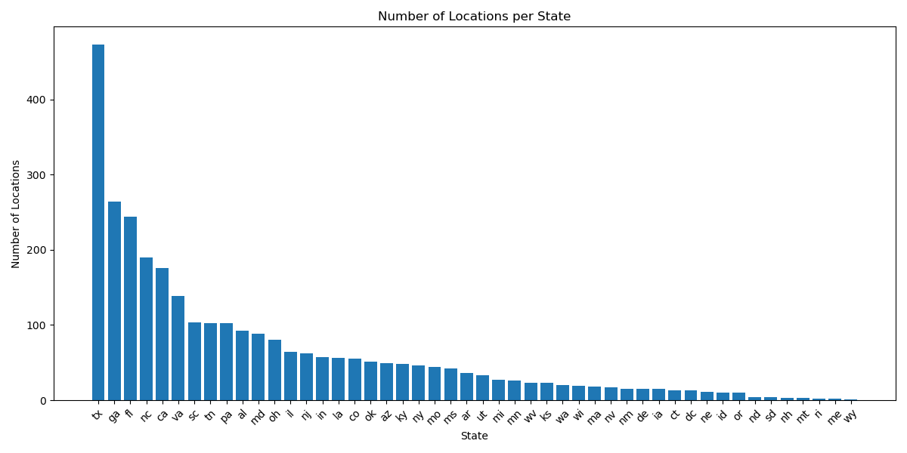
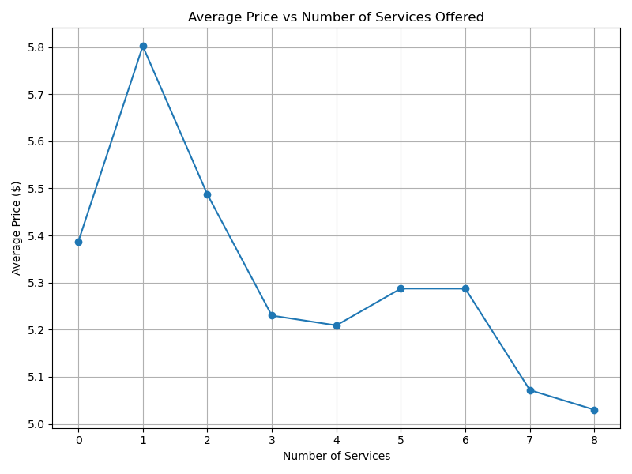
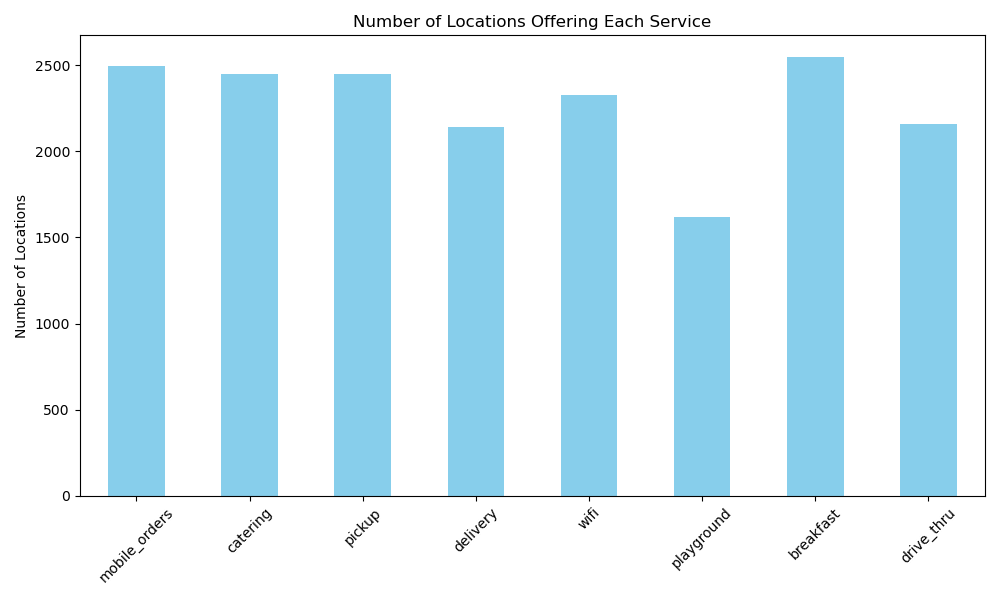
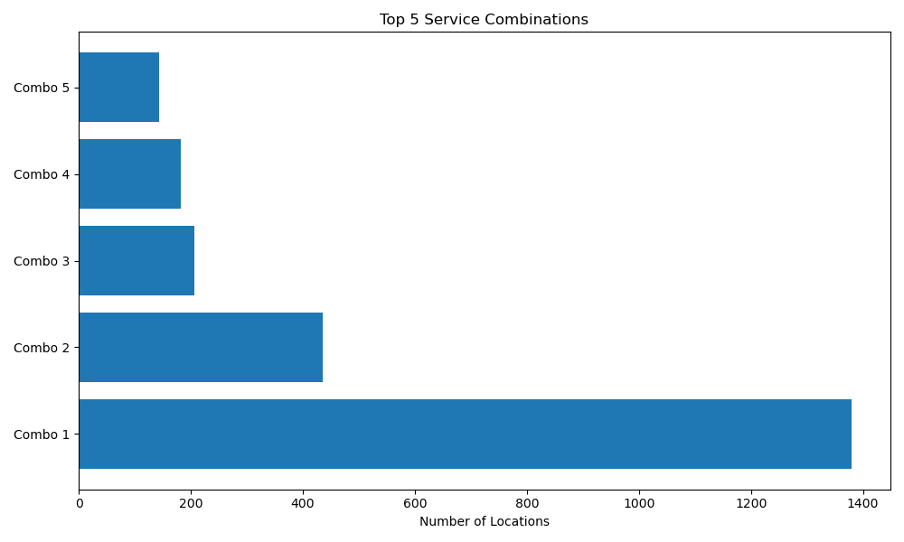
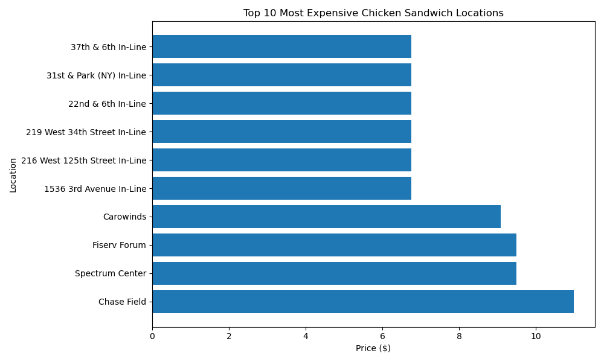
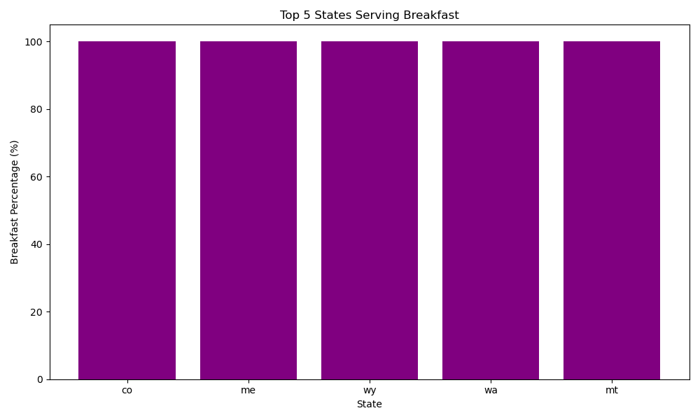
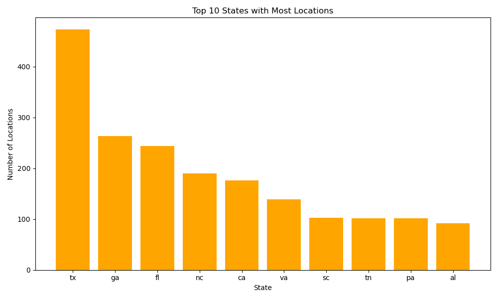
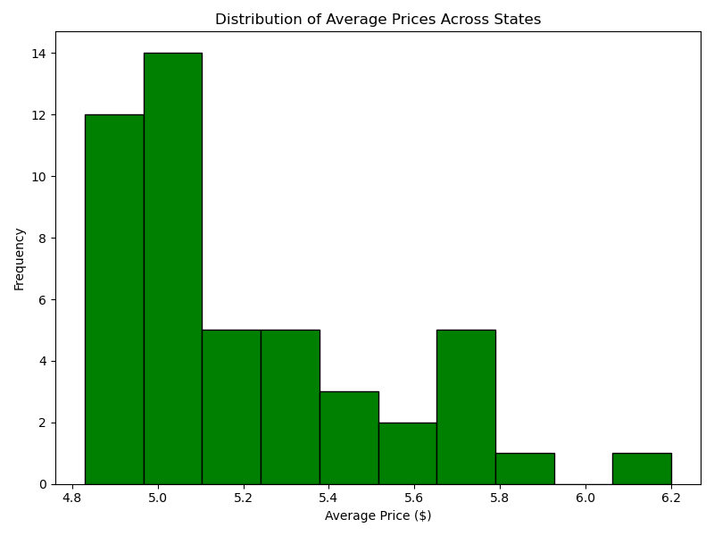

# 🍗 Chicken Sandwich Network Analysis

## 📖 Project Overview
This project provides a **comprehensive analysis** of a restaurant network offering chicken sandwiches across multiple U.S. states.  
It combines **SQL queries, Python data analysis, visualization**, and **PDF reporting** to extract actionable insights on:

- Average pricing of chicken sandwiches
- Availability of services (Breakfast, Mobile Orders, Wi-Fi, etc.)
- Distribution of restaurant locations across states
- Popular service combinations and operational patterns

> ⚠️ Note: A **Power BI dashboard** is currently under development for interactive exploration.

---

## 🗂️ Project Structure

Chicken_Sandwich_Analysis/
│
├── data/ # Raw datasets (CSV/Excel)
├── sql_queries/ # SQL scripts for data extraction
├── python_scripts/ # Python analysis scripts
├── visuals/ # Main visualizations
├── visuals_extra/ # Additional visualizations
├── Chicken_Sandwich_Network_Report

---

## 🚀 Getting Started

### Requirements
- Python 3.8+
- Libraries: `pandas`, `matplotlib`, `seaborn`, `fpdf`
- SQL Server (for running queries)
- Power BI (In progress)

---

### Usage
Run SQL queries in sql_queries/ to extract the necessary data.

### Execute Python scripts in python_scripts/:
data_analysis.py → Clean, process, and visualize data

### generate_report.py → Generate a full PDF report

## Output:
-visuals/ → Main charts
-visuals_extra/ → Additional charts
-Chicken_Sandwich_Network_Report.pdf → Complete report

---

## 📊 Visualizations

### Main Charts

#### 1️⃣ Average Chicken Sandwich Price per State
  
Displays average chicken sandwich prices across states, showing a general decreasing trend. NY and DC have the highest prices (~$6.2), while AZ and NH are lowest (~$4.8–$4.9).

#### 2️⃣ Breakfast Availability Percentage per State
  
Illustrates the proportion of locations offering breakfast per state. CA, TX, NY lead with 89–82%, WA and FL slightly lower (78–80%).

#### 3️⃣ Number of Locations per State
  
Shows location distribution across states. TX has 470 locations; GA 260, FL 245; smaller states have <100 locations.

#### 4️⃣ Average Price vs Number of Services Offered
  
Examines correlation between the number of services and sandwich price. Slight downward trend; more services correlate with marginally lower prices.

#### 5️⃣ Number of Locations Offering Each Service
  
Breakfast (~2500 locations) and Mobile Orders (~2200) are most common; Playground and Drive-thru are least (~200–600).

#### 6️⃣ Top 5 Service Combinations
  
Combo 1 dominates with ~1400 locations; subsequent combos have fewer locations.

#### 7️⃣ Top 10 Most Expensive Chicken Sandwich Locations
  
Prices range 9–11 $. Highest prices observed in stadiums and high-traffic areas.

---

### Additional Charts

#### Top 5 States Serving Breakfast
  
CA 89%, TX 85%, NY 82%, FL 80%, WA 78%.

#### Top 10 States with Highest Average Sandwich Price
  
NY 6.20, DC 5.90, WA 5.80, MA 5.78, CA 5.75, OR 5.70, RI 5.70, CT 5.65, NH 5.50, AZ 5.45.

#### Top 10 States with Most Locations
  
TX 470, GA 260, FL 245, MA 190, CA 175, OR 140, RI 100, CT 100, NH 100, AZ 95.

#### Distribution of Average Prices Across States
  
Histogram shows clustering between $5

---

## 📌 Key Findings & Recommendations
### Key Findings:
-Price disparities exist across states; NY highest, AZ lowest.
-Breakfast and Mobile Orders are core services; Playground and Drive-thru less common.
-TX dominates in number of locations; other states have <100.
-Popular service combinations indicate operational efficiencies.
-Slight negative correlation between number of services and average price.

## Recommendations:
-Adjust pricing in high-cost states; consider promotions in low-price states.
-Expand less common services in high-demand regions.
-Target states with fewer locations for expansion opportunities.
-Focus on popular service combinations to optimize operations.
-Maximize breakfast promotions in top states; incentivize in lower-percentage states.

---

## 🖥️ Next Steps
-Build Power BI dashboards using processed datasets and visualizations.
-Enable interactive filtering by state, service, and price ranges.
-Explore seasonal trends and regional promotions.

## 🏷️ Author
### Prepared by: 
**Mohamed Emad Alhadi - Data Analyst**
### Date: 
***September 2025***

